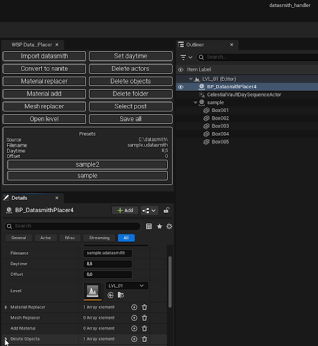

# Datasmith Handler

Datasmith Handler is an Unreal Engine Editor Utility Widget built to accelerate large Datasmith scene ingests through a non-destructive, repeatable workflow. The widget places the entire import, clean-up, and replacement pipeline into a single side panel so you can import, wipe folders, remap materials, delete stray actors, and re-run everything in seconds whenever the source files change.

> Built and tested on Unreal Engine **5.7** (tools branch). A downport to earlier versions is planned once the feature set stabilizes; suggestions and ideas are very welcome while the tool keeps evolving for fun and experimentation.

---

## User Interface and Operations

### Interface Description

1. **Left Panel (Toolbox):** Preset list sourced from your `DataAsset` files and the action buttons that operate on the active preset.
2. **Center Panel (Details):** Live property sheet for the selected preset, perfect for quick tweaks before re-running the pipeline.
3. **Right Panel (Outliner Preview):** Displays how the automatically spawned Blueprint organizes the imported hierarchy. Keep either a `CelestialVaultDaySequenceActor` or a `SunSky` actor handy for lighting control—the system will reference whichever one you place in the Outliner.

### Operations

- `Import datasmith`: Imports using the preset `Source` path and `Filename`.
- `Convert to nanite`: Batch converts meshes brought in through the preset.
- `Material replacer`: Runs name-based material swap rules.
- `Mesh replacer`: Executes mesh substitution rules.
- `Material add`: Adds extra materials where the Datasmith file lacks assignments.
- `Set daytime`: Applies the stored Daytime configuration.
- `Delete actors / objects / folder`: Cleans targeted actors or entire Datasmith folders.
- `Open level / Save all`: Convenience actions for broader scene management.

Presenting the interface first clarifies the effect of each preset before authoring configurations.

---

## Key Features

- Centralized preset system powered by `DataAsset` blueprints
- Automated Datasmith import, Nanite conversion, and Daytime setup
- String-driven rules for deleting, replacing, or adding materials and meshes
- Scene clean-up helpers for actors, folders, and levels
- Live layout panel that keeps presets, details, and outliner context in sync

---

## Getting Started

Run the main widget inside the Unreal Editor:

1. In the Content Browser navigate to `Content > Tools > DatasmithPlacer`.
2. The plugin structure contains `Blueprint`, `DataAsset`, `DataAssetConfigure`, `Enum`, `Struct`, and `UI` folders.
3. Right-click the highlighted Editor Utility Widget and choose `Run Editor Utility Widget`.

---

## Creating Data Assets

Data Assets are the heart of the workflow—each one captures an import preset you can re-run at any time.

1. Open the `DataAsset` folder.
2. Duplicate the `Sample` asset (or create a child of the same class) for every Datasmith file you need to manage.
3. Rename the new asset; the widget reads this identifier when listing presets.

---

## Configuring a Data Asset

Open any Data Asset to author import settings and rule sets.

### 1. General Settings & Delete Rules

- `Source`: Absolute directory that stores the `.udatasmith` file (example: `C:\datasmith\`).
- `Filename`: Exact Datasmith filename (example: `sample.udatasmith`).
- `Daytime / Offset`: Default lighting configuration that can be re-applied later.
- `Delete Objects`: Array of name-based filters; any imported actor whose label matches the string (example: `Box002`) is removed automatically.

### 2. Material Replacement

- `Material Replacer`: Array-driven rules that map Datasmith material names to Unreal materials.
  - `Info`: Optional note describing the intent of the rule.
  - `Find Material`: Source material string to match during import.
  - `New Material`: Unreal material asset used as the substitute.

> Mesh Replacer and Add Material arrays follow the same pattern, enabling geometry swaps or material injections where the source file lacks assignments.

---

This loop ensures you can iterate on the source file, re-import, and re-run every rule with a single click while keeping the project consistent and non-destructive.
